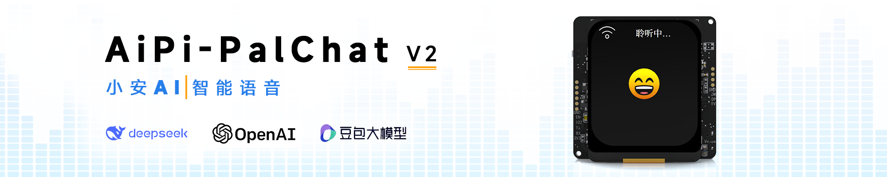
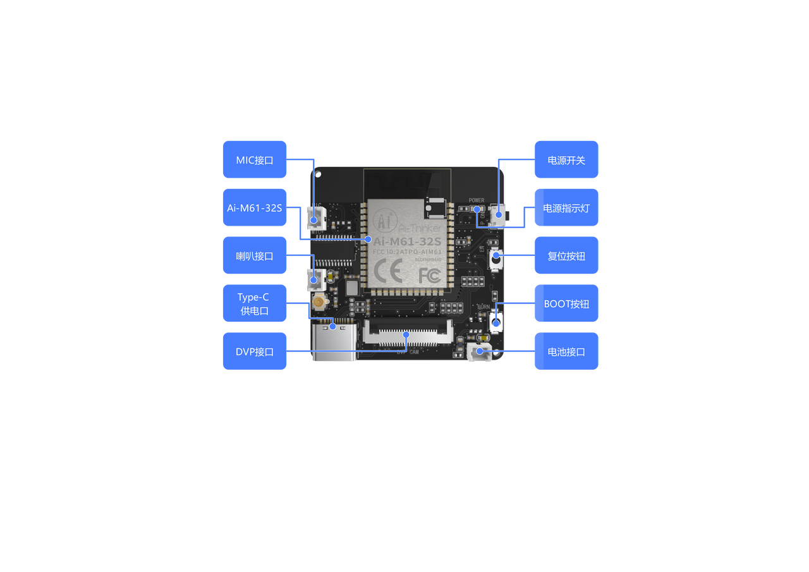
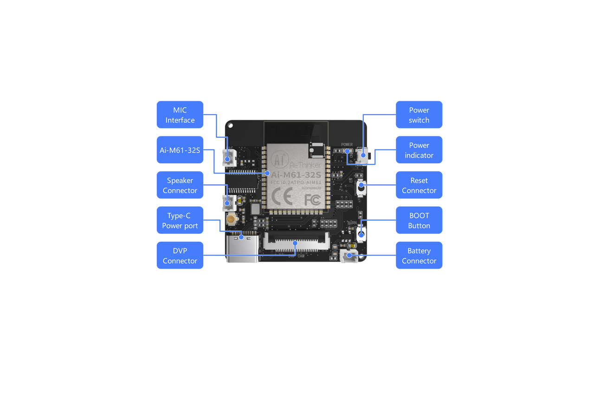
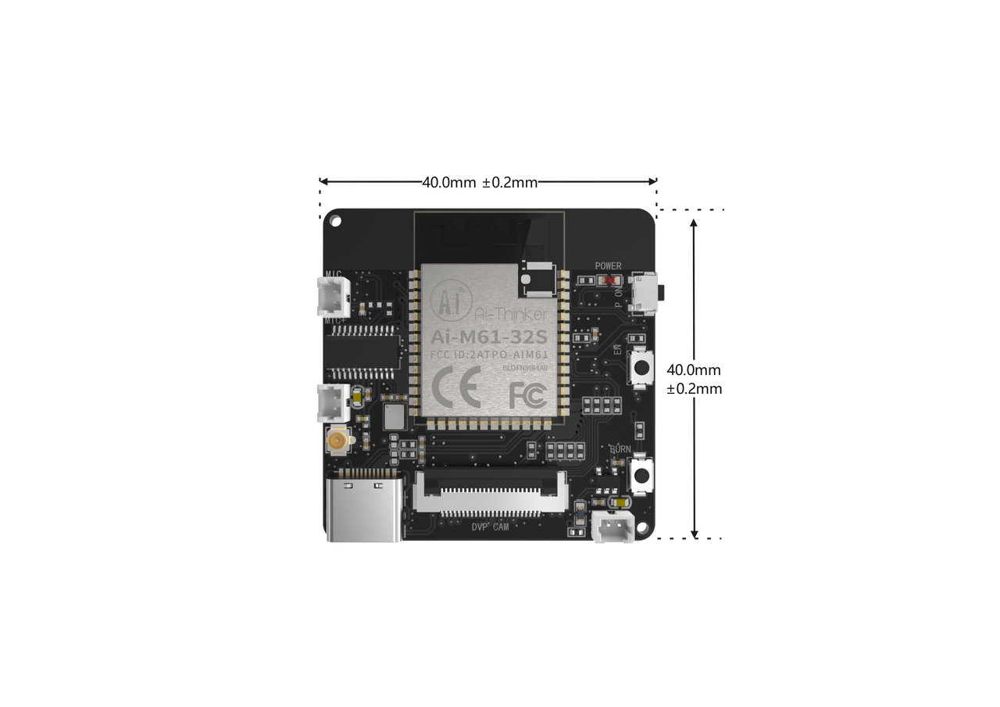
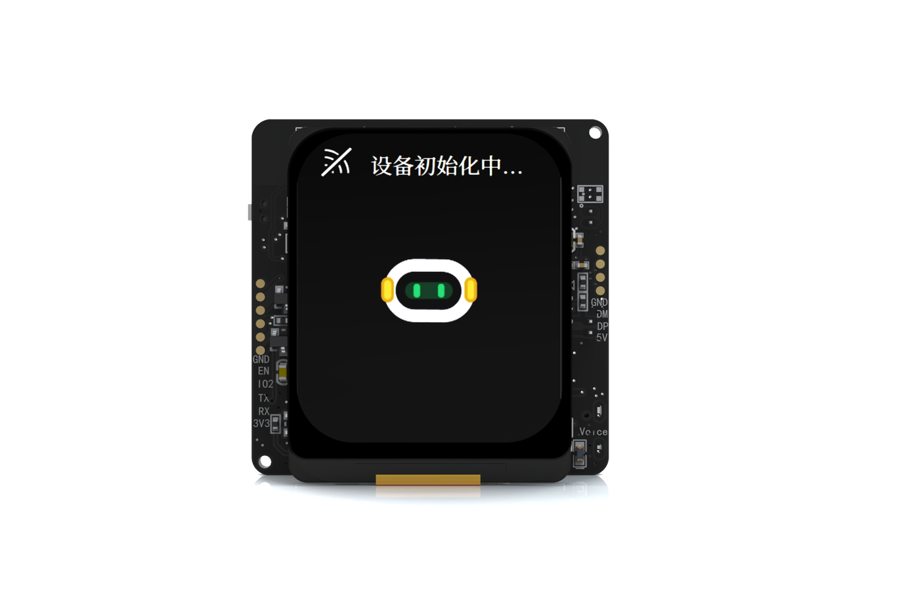
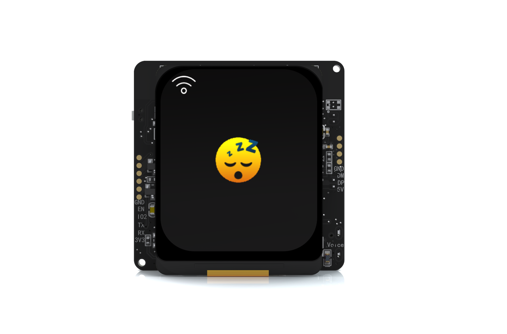
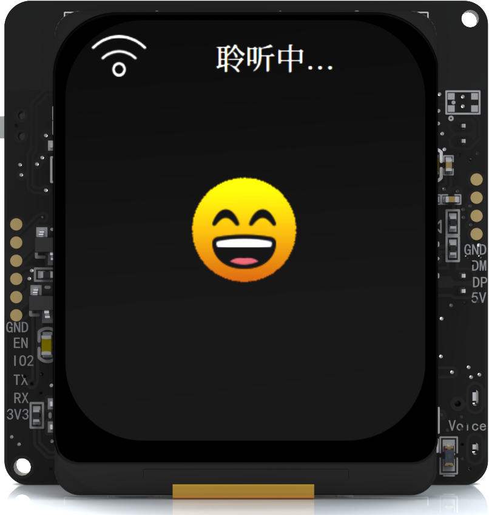

# 小安AI AiPi-PlaChatV2 
## 一、产品概述
**AiPi-PalChatV2** 是一款接入了 火山引擎 或 OpenAi 的高性能语音交互开发板，专为智能语音场景设计。基于安信可 Ai-M61-32S 模组主控，具备高集成度、高性能等特性，支持 离线语音唤醒 与 语音打断 功能，结合 2W/8Ω 扬声器与双供电模式（Type-C + 电池），通过安信可IOT小程序进行配网，智能体选择&配置，快速部署语音交互能力的硬件创新场景。
### 1. 核心功能亮点
- 离线语音交互
  - 支持离线语音唤醒，解放双手
  - 支持语音打断，提升交互自然度
- 灵活供电模式
  - Type-C 有线供电，适配常规电源环境
  - 电池供电设计，满足移动场景需求
- 高性能硬件配置
  - 小尺寸板载设计，易于集成到各类设备中
  - 1.69寸TFT彩屏显示画面
  - 2W/8Ω 扬声器提供清晰音效输出
- 便捷开发与配置
  - 微信小程序一键配网，简化设备联网流程
  - 智能体配置可视化，支持自定义音色与场景逻辑
- 彩色屏显
  - 聊天内容一目了然
  - 可自由定制UI

### 2. 可选 AI 模型

|  |  |  |
| :---: | :---: | :---: | 

### 3. 技术参数

|模块|参数详情|
| :---: | :---: | 
|主控|安信可Ai-M61-32S 模组（Wi-Fi6/BLE双模）|
|唤醒方式|离线语音唤醒，语音打断|
|喇叭参数|2W/8Ω喇叭|
|显示屏|1.69 寸 SPI TFT彩屏|
|供电方式|Type-C（5V） + 电池|
|开发支持|SDK 二次开发接口|
### 4. 适用场景
- 智能终端
  - 作为语音中控模块，嵌入灯具、窗帘、家电等设备，实现本地化语音控制。
  - 改造传统家居为智能语音交互场景。
- 教育/儿童玩具
  - 集成到早教机、故事机中，支持离线语音问答与互动内容播放。
- 社交娱乐
  - 情感陪伴：语音输入，丰富交流情境，提供更真实陪伴
  - 角色扮演：灵活扮演各类角色，遵循人设逻辑，长期记忆记住用户喜好与过往交流，构建沉浸式互动体验
  - 剧情创作：基于设定好的故事背景和人设，自动推演剧情，在互动或游戏中，让用户获得创作乐趣
- 消费零售
  - 导购助手：灵活切换AI买家或卖家模拟，量身定制培训计划，让客服快速成为销冠。
  - VOC洞察分析：通过豆包大模型多维度挖掘消费者需求，洞察流失原因，辅助提升询单转化率，同时为产品开发、业务运营等提供数据支撑

## 二、接口定义

### 1. 中文接口图

### 2. 英文接口图

## 三 尺寸大小

## 四、屏幕显示

| |  |  |
| :---: | :---: | :---: | 

## 五、快速使用
2. 小智AI:[使用说明——小智AI](https://docs.ai-thinker.com/aipi-palchatv2/instructions_xiaozhi)
1. 火山引擎:[使用说明——火山引擎](https://docs.ai-thinker.com/aipi-palchatv2/instructions)

## 六、二次开发,请参考: [二次开发](https://docs.ai-thinker.com/aipi-palchatv2/)

