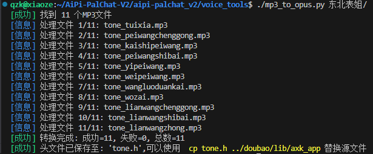
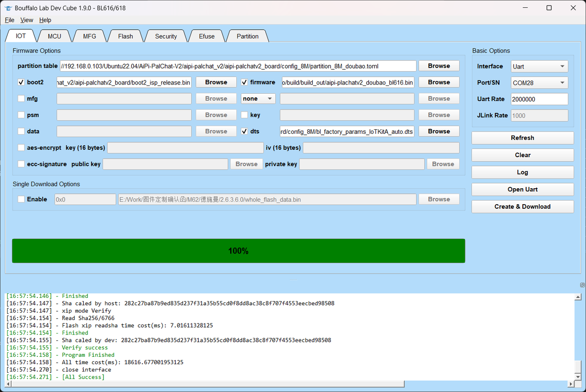

# 提示音制作工具
## 一、MP3 文件获取
- 首先制作提示音。mp3 
  - 推荐网站：https://www.text-to-speech.cn/
- 格式要求：
  - 16KHz 
  - 单声道音频
  - 深度 32bit
- 提示音列表，该文件的路径：aipi-palchat_v2/doubao/lib/axk_app/tone.h

> [!WARNING] 注意
> 提示音的名称不能改变，否则会影响后续步骤的进行！

|序号|提示音数组名称|示例内容|
|:--:|:--:|:--:|
|1|tone_wozai|我在|
|2|tone_weipeiwang|我是你的人工智能语音助手。请对我说：你好小安。开始配网|
|3|tone_kaishipeiwang|进入配网模式，请使用安信可小程序或 App 进行配网|
|4|tone_peiwangshibai|配网超时，请重试|
|5|tone_peiwangchenggong|配网成功|
|6|tone_lianwangchenggong|联网成功|
|7|tone_wangluoduankai|网络异常，重新连接|
|8|tone_lianwangzhong|联网中|
|9|tone_lianwangshibai|联网失败|
|10|tone_yipeiwang|我是你的人工智能语音助手。请对我说：你好小安。唤醒我|
|11|tone_tuixia|退下了|

## 二、音频转换
为了大家方便使用直接生成音频数组，我们提供了一个将 MP3 文件夹批量转换为 Opus 格式（16kHz 采样率、单声道）的 C 语言头文件的 Python 脚本。这个脚本会使用 ffmpeg 进行格式转换，运行之前请安装好脚本执行的依赖工具。
### 2.1 脚本环境安装
- 安装python3，如已有请跳过，使用python --version查看是否已安装
```shell
sudo apt-get install python3
```
- 安装ffmpeg以及opus编码器
```shell
sudo apt-get install ffmpeg libopus0 libopus-dev
```
### 2.2 运行脚本
- 进入到 voice_tools 文件夹
```shell
cd voice_tools
```
- 执行脚本
```shell
./mp3_to_opus.py 东北表姐/
```


### 2. 替换文件
- 将生成的 tone.h 替换 aipi-palchat_v2/doubao/lib/axk_app/tone.h
```shell
cp tone.h ../doubao/lib/axk_app
```

## 三、编译测试
### 1. 回到工程目录编译
```shell
cd ../doubao
make
```
### 2. 烧录


## 四、问题及解决方法
### 1. 安装opuslib和numpy库时出错
只是因为环境问题导致的安装出错，可按照以下步骤解决。

- 安装 python 虚拟环境工具
```shell
sudo apt install python3-venv
```

-  创建虚拟环境（例如在项目目录）
```shell
python3 -m venv myenv
```
- 激活虚拟环境
```shell
source myenv/bin/activate
```
- 重新安装依赖库
```shell
pip3 install ffmpeg-python pydub numpy opuslib
```